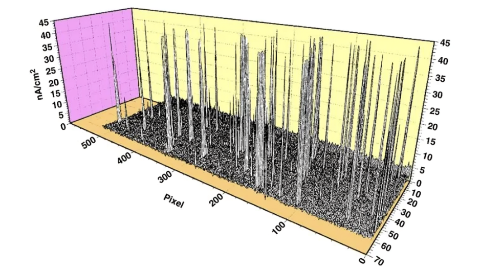
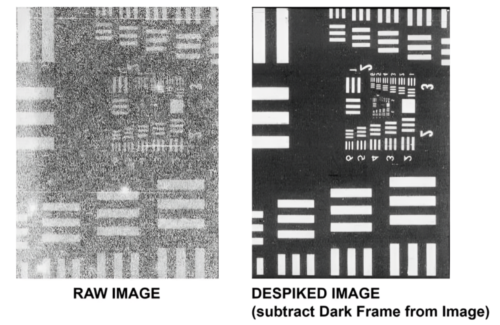

## Dark Noise Subtraction AI Model

- Dark noise: variation in dark current which results from statistical fluctuations in the number of thermally generated electrons. 
- Dark current: number of thermally generated electrons in the absence of light
- Dark signal: total signal generated by dark current and dark noise

Overall: DS = DC + DN

## Dark Current
The dark current isn’t uniform over an image sensor surface due to imperfections in the silicon crystal structure and low concentrations of impurities. 
A three-dimensional plot of dark current across an image sensor surface exhibits significant areal nonuniformity, eg:

## Drak Frame Subtraction
Background subtraction applied to remove dark current.

## Dark Noise
The noise has two different components: dark shot noise and dark fixed pattern noise.

1. Dark Shot Noise
    - Like the shot noise associated with light, the dark shot noise is mathematically equal to the square root of the number of thermally-generated electrons within the integration period:

                   dark shot noise (e-) = SQRT (N(e-))

        Dark shot noise cannot be removed from the image. If practical, cool the sensor.

2. Dark Fixed Pattern
    - Dark fixed pattern noise (DFPN) is caused by the non-uniform distribution of the dark leakage current, 

                              DFPN = DSNU * N(e-)

    Dark signal non-uniformity (DSNU) is determined empirically.

## Procedure brief

- Around 500 dark frames should be acquired at the same temperature and settings as expected at the orbit
- Average the dark frames and subtract from signal images
- This method is good only if the temperature is known within an error of 0.1 C, otherwise software estimation of dark frames perform better like: [https://apps.dtic.mil/sti/pdfs/ADA596420.pdf] [https://apps.dtic.mil/sti/pdfs/ADA479337.pdf].

Currently, working on meta data matching technique. 
